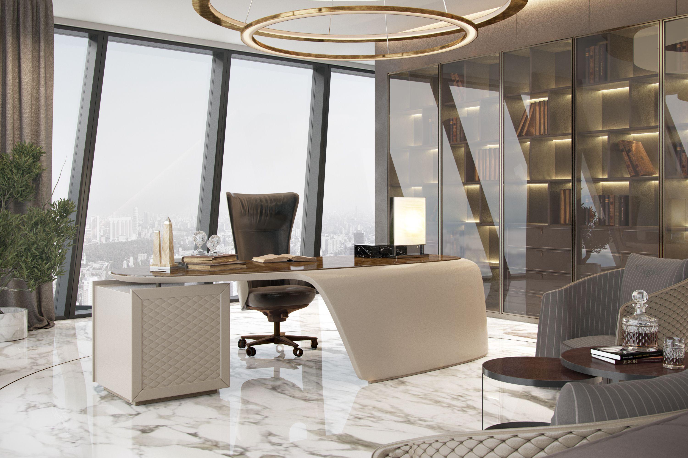
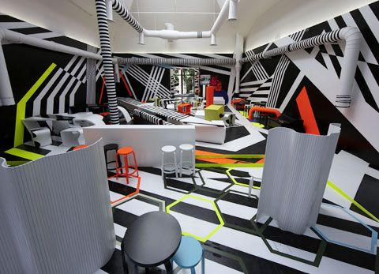
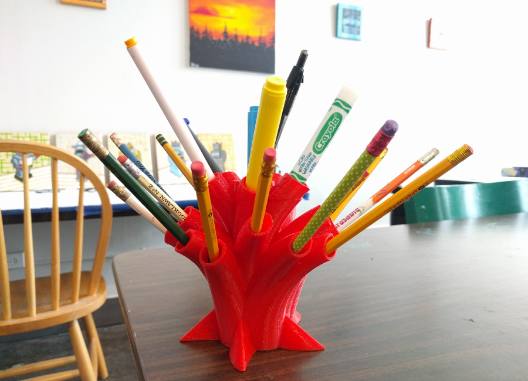

## Co-working Space
---

#### Adriana
#### Jun 1st, 2018

### Description

UI design for co-working space alike business

### Brainstorming
- material credits go to below sites:
  - [hackerspace](http://pdxhackerspace.org/)
  - [google](google.com)

| Requests  |  Keywords |  Solution | examples|
|---|---|---|---|---|
| Impression | Luxurious, cool, high-end, inclusive  |   High quality images galleries||
| Main Concept|  Unique, funky, local, less corporate | Unique painting on the wall or floor, funky display items or stickers on desk, stories | |
| Target Audience|  Tech People, Artists, day-traders, writes etc. |   Advertise in various communities||

### Images

Screenshots of your Sketch wireframes should go here. Make sure to include all versions (if you have different mobile, tablet, desktop, etc.) designs. Use Dropbox or another free image hosting service to host your images.

#### Desktop Version

#### Mobile Version

### Technologies and Resources

- Sketch

### Responsiveness

- Desktop
- tablet
- Mobile

### Setup Instructions

- Clone the project
- Navigate to sketch folder
- View different sketches

### Roadmap

- Register / Login

### License

MIT

Copyright (c) 2018 **_Adrianacmy_**
