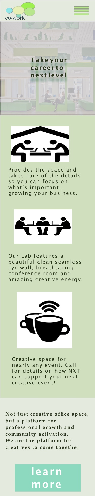

## Co-working Space
---

#### Adriana
#### Jun 1st, 2018

### Description

UI design for co-working space alike business

### Brainstorming
- material credits go to below sites:
  - [hackerspace](http://pdxhackerspace.org/)
  - [google](google.com)

 

### Images

#### Desktop Version

#### Tablet Version

#### Mobile Version

### Technologies and Resources

- Sketch

### Responsiveness

- Desktop
- tablet
- Mobile

### Setup Instructions

- Clone the project
- Navigate to sketch folder
- View different sketches

### Roadmap

- Register / Login

### License

MIT

Copyright (c) 2018 **_Adrianacmy_**
